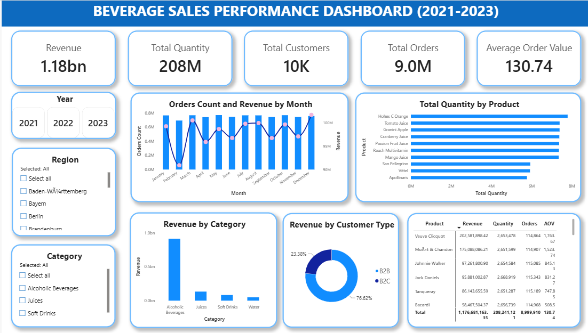

# Beverage Sales Performance Analysis (2021 - 2023)

## 📌 Project Overview
This project analyzes the sales performance of a beverage company from 2021 to 2023. Using **SQL (PostgreSQL)** for data extraction and **Data Visualization tools (Excel/Power BI)** for reporting, the project explores revenue trends, customer behaviors (B2B vs. B2C), discount impacts, and regional sales distribution to provide data-driven business recommendations.

## 📊 Key Business Insights (KPIs)
* **Total Revenue:** 1.18 Billion (bn)
* **Total Units Sold:** 208 Million (M)
* **Total Orders:** 9.0 Million (M)
* **Average Order Value (AOV):** 130.74
* **Total Customers:** 10K

---

## 🗂️ Data Structure
The dataset is stored in the `beverage_sales` table with the following schema:

| Column Name | Data Type | Description |
| :--- | :--- | :--- |
| `order_id` | VARCHAR(20) | Unique identifier for each order |
| `customer_id` | VARCHAR(20) | Unique identifier for each customer |
| `customer_type` | VARCHAR(10) | Customer segment (B2B / B2C) |
| `product` | VARCHAR(100)| Name of the beverage product |
| `category` | VARCHAR(50) | Product category (Alcoholic, Juices, Soft Drinks, Water) |
| `unit_price` | NUMERIC | Price per unit |
| `quantity` | INTEGER | Number of items purchased |
| `discount` | NUMERIC | Applied discount percentage |
| `total_price` | NUMERIC | Total order value after discount |
| `region` | VARCHAR(100)| Location/State where the order was placed |
| `order_date` | DATE | Date of the transaction |

---

## 💻 SQL Analysis & Business Questions

### 1. Yearly KPI Trends
Track how the company's core metrics changed over 2021, 2022, and 2023.
```sql
SELECT EXTRACT(YEAR FROM order_date) as year,
       COUNT(order_id) as total_order,
       COUNT(DISTINCT customer_id) as total_customer, 
       SUM(total_price) as total_revenue,
       SUM(quantity) as total_quantity,
       AVG(discount) as avg_discount,
       AVG(total_price) as avg_order_value
FROM beverage_sales
GROUP BY year;
```


### 2. Monthly Revenue Trend
Identify seasonality and peak sales months over time.

SELECT EXTRACT(YEAR FROM order_date) AS year,
       EXTRACT(MONTH FROM order_date) AS month,
       COUNT(order_id) AS total_orders,
       SUM(total_price) AS total_revenue
FROM beverage_sales
GROUP BY year, month
ORDER BY year, month;


### 3. Top 10 High-Performing Products
Analyze products by sales volume vs. revenue generation.
* **By Revenue:** High-end items like *Veuve Clicquot* (~202M) and *Moët & Chandon* (~175M) generate the most value.
* **By Volume:** Affordable options like *Hohes C Orange* (7.7M units) and *Tomato Juice* (7.3M units) have the highest demand.

SELECT product,
       SUM(quantity) AS total_quantity,
       SUM(total_price) AS total_revenue
FROM beverage_sales
GROUP BY product
ORDER BY total_revenue DESC
LIMIT 10;


### 4. Regional Revenue Contribution
Identify the top geographic areas contributing the most to the company's total sales.

SELECT region,
       SUM(total_price) AS total_revenue
FROM beverage_sales
GROUP BY region
ORDER BY total_revenue DESC
LIMIT 10;


### 5. Customer Segment Analysis (B2B vs. B2C)
Compare the purchasing behavior of retail consumers against business clients. While B2C customers account for the majority of order volume (**76.62%**), B2B customers yield a significantly higher Average Order Value (AOV).

SELECT customer_type,
       COUNT(order_id) AS total_orders,
       SUM(total_price) AS total_revenue,
       AVG(total_price) AS average_order_value
FROM beverage_sales
GROUP BY customer_type;


### 6. Discount Impact Analysis
Evaluate if offering higher discounts effectively drives more sales and increases revenue.

SELECT discount,
       COUNT(order_id) AS total_orders,
       SUM(quantity) AS total_quantity,
       SUM(total_price) AS total_revenue
FROM beverage_sales
GROUP BY discount;


---

## 📊 Dashboard Visualizations

Here is the interactive **Beverage Sales Performance Dashboard** used to monitor business health:



### Key Takeaways from the Dashboard:
1. **Revenue by Category:** **Alcoholic Beverages** is the absolute powerhouse of the business, contributing **911.8M** out of the total 1.18B revenue, heavily outperforming Juices, Soft Drinks, and Water.
2. **Regional Performance:** Sales are distributed quite evenly across German states, with **Hamburg** (~82.4M) and **Hessen** (~78.4M) taking the lead as the most lucrative markets.
3. **Time-Series Insights:** A recurring dip in both orders and revenue is visible in **February** every year, followed by a strong recovery in March.

---

## 🛠️ Tech Stack & Tools Used
* **SQL (PostgreSQL):** Used for database creation, heavy data aggregation, and complex date-time analytical queries.
* **Excel Pivot Tables:** Used for quick data validation and exploratory data summaries.
* **Power BI / Excel Dashboard:** Used to design a clean, responsive executive dashboard for stakeholder reporting.
